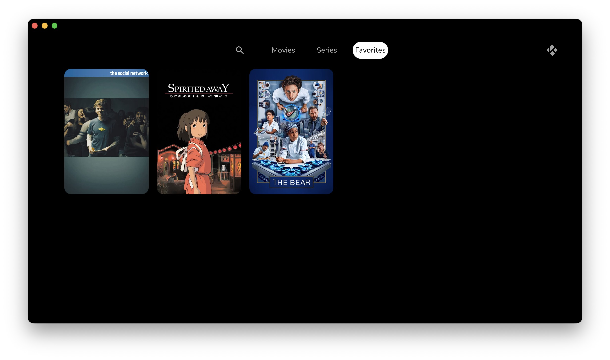
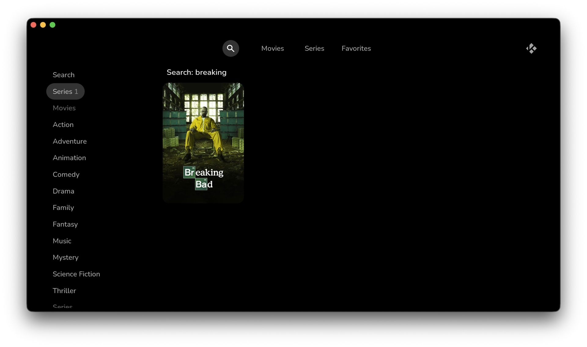

# Ilbi

> ⚠️ **Work in progress.** This skin is under active development — things may break or change without notice.

A minimalist, streaming-service-style skin for [Kodi](https://kodi.tv), forked from Estuary.

Scope is deliberately narrow: **movies and TV shows only**.

## Screenshots






## Skin settings

Reachable from Kodi Options (the logo in the top right) → Skin settings. Four categories.
Every row the Movies and Series toggles can hide is also on the **My Kodi** screen, which always
shows all of them:

**General**

| Setting | Default | |
| --- | --- | --- |
| Use slide animations | on | Slide transitions between windows and views |
| Enable auto scrolling for plot & review | off | Auto-scrolls long plot text |
| Show media flags | on | Resolution / codec / audio badges on media items |
| Rounded poster corners | on | Use rounded corners everywhere |
| Favorites menu item | off | Standalone Favorites entry in the main menu; its content is also a row on My Kodi |
| Choose kind of profile identification | — | Profile name, avatar, or none |

**Movies**

| Setting | Default | |
| --- | --- | --- |
| Random movie spotlight | off | Hero spotlight above the movie rows |
| Movie genre rows | on | One poster row per genre on the movies home screen, and the movie half of the search side list |
| In progress movies row | off | Continue watching row on the movies home screen |
| Unwatched movies row | off | Unwatched row on the movies home screen |
| Recently added movies row | off | Recently added row on the movies home screen |
| Default select action for movie sets | — | Browse, continue watching, play from beginning, play next, or queue |

**Series**

| Setting | Default | |
| --- | --- | --- |
| Random series spotlight | off | Hero spotlight above the series rows |
| Series genre rows | on | One poster row per genre on the series home screen, and the series half of the search side list |
| In progress series row | off | Continue watching row on the series home screen |
| Unwatched series row | off | Unwatched row on the series home screen |
| Recently added episodes row | off | Recently added row on the series home screen |
| Default select action for TV shows | — | Same options as movie sets |

**On screen display**

| Setting | Default | |
| --- | --- | --- |
| Automatically close video OSD | off | |
| — Video OSD autoclose time (seconds) | — | Only editable when autoclose is on |

## Development

Tasks are run with [mise](https://mise.jdx.dev):

```sh
mise bump 0.1.0       # set the skin version in addon.xml
mise bundle           # package the skin into dist/skin.ilbi-<version>.zip
mise fmt              # format the skin XML with xmllint
mise fmt:check        # fail if any skin XML is not formatted
mise install-fonts    # fetch fonts from Google Fonts
mise lint             # check the skin XML is well-formed
mise mockgen          # generate a mock Kodi library to browse
mise release v0.1.0   # tag and push a release (omit the tag to bump the patch)
mise symlink          # symlink the skin into Kodi's addons directory
```

## License

Creative Commons Attribution Non-Commercial Share-Alike 4.0 — see [LICENSE.txt](LICENSE.txt).
