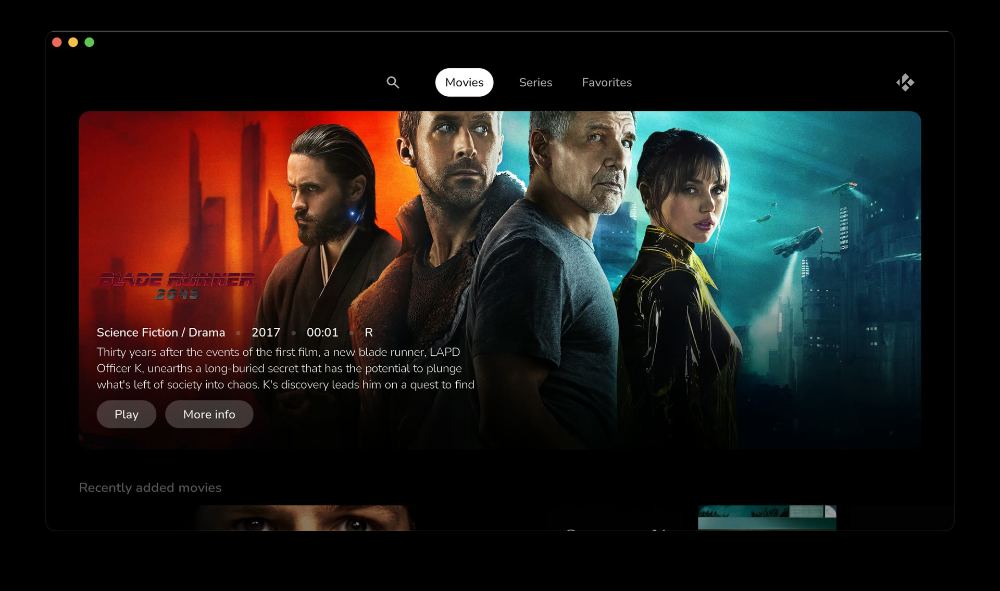
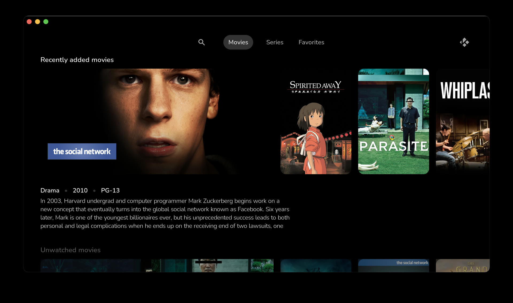

# Ilbi

WIP minimalist, streaming-service-style skin for [Kodi](https://kodi.tv), forked from Estuary.

Scope is deliberately narrow: **movies and TV shows only**.

## Screenshots





## Skin settings

Reachable from Kodi Options (the logo in the top right) → Settings → Interface → Skin →
Configure skin. Four categories:

**General**

| Setting | Default | |
| --- | --- | --- |
| Use slide animations | on | Slide transitions between windows and views |
| Enable auto scrolling for plot & review | off | Auto-scrolls long plot text |
| Touch mode | off | Larger touch targets |
| Show media flags | on | Resolution / codec / audio badges on media items |
| Choose rating to display for media items | — | User rating, rating, or none |
| Choose kind of profile identification | — | Profile name, avatar, or none |

**Main menu items**

| Setting | Default | |
| --- | --- | --- |
| Enable category widgets | on | Genre / year category rows on the home screen |
| Movies | on | Show the Movies menu item |
| — Random movie spotlight | off | Hero spotlight above the movie rows |
| — Edit categories | — | Opens the library node editor add-on |
| — Default select action for movie sets | — | Browse, continue watching, play from beginning, play next, or queue |
| TV shows | on | Show the Series menu item |
| — Random series spotlight | off | Hero spotlight above the series rows |
| — Edit categories | — | Opens the library node editor add-on |
| — Default select action for TV shows | — | Same options as movie sets |
| Favourites | on | Show the Favorites menu item |

**Artwork**

| Setting | Default | |
| --- | --- | --- |
| Show media fanart as background | on | Uses item fanart behind the UI |
| Choose skin fanart pack | — | Needs the `script.image.resource.select` add-on |
| Select genre fanart pack | — | Needs the same add-on |

**On screen display**

| Setting | Default | |
| --- | --- | --- |
| Automatically close video OSD | off | |
| — Video OSD autoclose time (seconds) | — | Only editable when autoclose is on |

## Development

Tasks are run with [mise](https://mise.jdx.dev):

```sh
mise install-fonts    # fetch fonts from Google Fonts
mise mockgen          # generate a mock Kodi library to browse
mise symlink          # symlink the skin into Kodi's addons directory
```

## License

Creative Commons Attribution Non-Commercial Share-Alike 4.0 — see [LICENSE.txt](LICENSE.txt).
